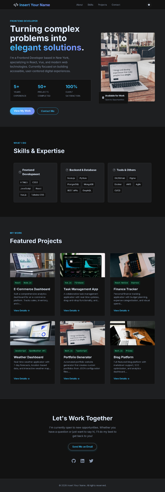

# Nexus Plumbing — Premium Plumbing Service Website

A modern, conversion-focused website for a premium plumbing service business in Nairobi, Kenya. Designed to generate leads through calls, WhatsApp messages, and form submissions with a high-end, professional UI.



---

## 📋 Table of Contents

- [Features](#-features)
- [Tech Stack](#-tech-stack)
- [Quick Start](#-quick-start)
- [File Structure](#-file-structure)
- [Customization Guide](#-customization-guide)
- [Business Features](#-business-features)
- [Deployment](#-deployment)
- [Browser Support](#-browser-support)
- [License](#-license)
- [Credits](#-credits)

---

## ✨ Features

- 🎯 **Lead Generation Focus** — Click-to-call, WhatsApp integration, and contact form with validation
- 📱 **Fully Responsive** — Mobile-first design that looks premium on all devices
- 🎨 **Premium UI/UX** — Glassmorphism effects, smooth animations, and bold typography
- ⚡ **Performance Optimized** — Pure HTML/CSS/JS, no frameworks, fast loading
- 🔍 **SEO Friendly** — Meta tags, semantic HTML, and optimized structure
- 🧭 **Sticky Navigation** — Always-accessible header with CTA buttons
- 💬 **Floating WhatsApp Button** — Always visible with hover tooltip
- 🗺️ **Google Maps Integration** — Embedded map showing service area
- ✅ **Form Validation** — JavaScript-powered validation with loading states
- 🎭 **Scroll Reveal Animations** — Intersection Observer for smooth entry effects
- 📦 **Configurable Content** — Optional config.js file for easy content management

---

## 🛠️ Tech Stack

| Technology | Purpose |
|------------|---------|
| HTML5 | Semantic structure |
| CSS3 | Styling, animations, responsive design |
| Vanilla JavaScript | Form validation, mobile menu, scroll effects |
| Font Awesome 6 | Icons |
| Google Fonts | Syne (headings) + Inter (body) |
| Intersection Observer API | Scroll reveal animations |
| config.js | Optional centralized content management |

---

## 🚀 Quick Start

### 1. Download & Extract
Download all three files (`index.html`, `style.css`, `script.js`) and place them in a folder.

### 2. Edit Business Information

#### A. Update Contact Details (`index.html`)

Search and replace the phone number throughout the file:
- Current placeholder: `+254700000000`
- Replace with your actual phone number

Update WhatsApp links:
```html
href="https://wa.me/254700000000?text=Hello..."
```

Update email address:
- `hello@nexusplumb.co.ke` → your business email

#### B. Update Business Name
Find all instances of:
- `NEXUSPLUMB` or `Nexus Plumbing`
- Replace with your business name

#### C. Update Google Map Location
In the iframe, change the map query:
```html
src="https://maps.google.com/maps?q=Nairobi%2C%20Kenya&t=&z=12&ie=UTF8&iwloc=&output=embed"
```
Replace `Nairobi, Kenya` with your specific service area.

### 3. Update Colors (`style.css`)

Edit the CSS variables at the top:
```css
:root {
  --navy-deep: #0A1428;      /* Dark background */
  --electric-blue: #2A6DFF;  /* Primary accent */
  --copper: #E05A1A;         /* CTA button color */
  --copper-hover: #c24b12;   /* Button hover state */
}
```

### 4. Update Services
Edit the services section in `index.html`:
```html
<div class="service-card">
  <div class="service-icon"><i class="fas fa-tools"></i></div>
  <h3>Pipe Repair & Leak Detection</h3>
  <p>Your service description here...</p>
</div>
```

### 5. Update Testimonials
Modify the testimonial cards with real customer reviews:
```html
<div class="testimonial-card">
  <div class="stars"><i class="fas fa-star"></i>...</div>
  <p>Customer review text</p>
  <div class="client"><strong>Name</strong><span>Location</span></div>
</div>
```

### 6. Test Locally
Open `index.html` in your browser to preview the website.

---

## 📁 File Structure

```
plumbing-website/
│
├── index.html          # Main HTML file (edit content here)
├── style.css           # All styles (edit colors, spacing here)
├── script.js           # JavaScript functionality (forms, menu, animations)
├── config.js           # (Optional) Centralized content configuration
├── images/             # (optional) Add your images here
│   ├── preview.png
│   └── hero-bg.jpg
└── README.md           # This file
```

---

## 🎨 Customization Guide

### Change Hero Background Image
In `style.css`, find the `.hero-bg` class:
```css
.hero-bg {
  background: url('https://your-image-url.jpg') center/cover no-repeat;
}
```
Replace with your own image URL.

### Modify Typography
In the `<head>` of `index.html`, update the Google Fonts link:
```html
<link href="https://fonts.googleapis.com/css2?family=Your+Font:wght@400;600;700;800&display=swap" rel="stylesheet">
```
Then update font families in `style.css`:
```css
body {
  font-family: 'Your Font', sans-serif;
}
h1, h2, h3, .logo {
  font-family: 'Your Heading Font', sans-serif;
}
```

### Adjust Spacing
Modify section padding in `style.css`:
```css
.section {
  padding: 100px 0;  /* Adjust vertical spacing */
}
.container {
  max-width: 1280px;  /* Adjust max width */
  padding: 0 32px;    /* Adjust side padding */
}
```

### Add More Services
Copy an existing `service-card` div and paste it inside the `services-grid` container:
```html
<div class="service-card" data-aos="fade-up" data-aos-delay="400">
  <div class="service-icon"><i class="fas fa-plus"></i></div>
  <h3>New Service</h3>
  <p>Service description here</p>
  <div class="card-hover-line"></div>
</div>
```

### Update Trust Stats
Modify the numbers in the hero section:
```html
<div class="stat-item">
  <span class="stat-number">1000+</span>
  <span class="stat-label">Happy Clients</span>
</div>
```

---

## 📦 Config.js — Centralized Content Management

For easier content management, you can use the optional `config.js` file to store all dynamic content in one place. This approach separates content from structure, making updates faster and safer.

### What is config.js?

`config.js` is a JavaScript file that contains all your website's content (text, images, services, testimonials) as a single object. The website then reads this object and dynamically renders the content.

### Benefits of Using config.js

| Benefit | Description |
|---------|-------------|
| ✅ **No HTML Editing** | Change content without touching HTML structure — perfect for non-technical users |
| ✅ **Centralized Management** | All content (text, images, services, testimonials) stored in one file |
| ✅ **Easy Updates** | Update once, changes appear everywhere the content is used |
| ✅ **Non-Technical Friendly** | Clients and content managers can edit without breaking layout or code |
| ✅ **Version Control** | Track content changes separately from code changes in Git |
| ✅ **Reusable** | Use the same config structure for multiple projects or pages |
| ✅ **Error Prevention** | No risk of accidentally deleting HTML tags or breaking structure |
| ✅ **Faster Development** | Add new sections by simply adding data to the config object |

### How to Use config.js

1. **Create `config.js` in your project root:**
```javascript
// config.js
const siteConfig = {
  // Business Info
  businessName: "Nexus Plumbing",
  phone: "+254700000000",
  email: "hello@nexusplumb.co.ke",
  whatsapp: "https://wa.me/254700000000",
  
  // Hero Section
  hero: {
    tagline: "Nairobi's Premier Plumbing Service",
    headline: "Premium Plumbing. 30-Minute Emergency Response.",
    subheadline: "Certified experts, transparent pricing, and white-glove service across Nairobi.",
    ctaText: "Call Emergency Line",
    ctaWhatsapp: "Chat on WhatsApp"
  },
  
  // Services
  services: [
    {
      icon: "fas fa-tools",
      title: "Pipe Repair & Leak Detection",
      description: "Advanced acoustic detection to locate and repair leaks without damaging your property."
    },
    {
      icon: "fas fa-water",
      title: "Drain Cleaning & Unblocking",
      description: "Hydro-jetting, snaking, and camera inspection to clear stubborn blockages."
    }
    // Add more services...
  ],
  
  // Testimonials
  testimonials: [
    {
      rating: 5,
      text: "Incredible service. They arrived within 25 minutes...",
      name: "Michael O.",
      location: "Kilimani"
    }
    // Add more testimonials...
  ]
};
```

2. **Link config.js in your HTML:**
```html
<script src="config.js"></script>
<script src="script.js"></script>
```

3. **Modify script.js to read from config:**
```javascript
// Example: Dynamically render services
function loadServices() {
  const servicesContainer = document.querySelector('.services-grid');
  servicesContainer.innerHTML = siteConfig.services.map(service => `
    <div class="service-card">
      <div class="service-icon"><i class="${service.icon}"></i></div>
      <h3>${service.title}</h3>
      <p>${service.description}</p>
    </div>
  `).join('');
}
```

### When to Use config.js

- **For client projects** — When clients need to update content themselves
- **For multilingual sites** — Easily switch between language files
- **For rapid prototyping** — Quickly change content without editing HTML
- **For A/B testing** — Swap content variations by changing one file
- **For CMS integration** — Connect to a headless CMS like Contentful or Sanity

---

## 💼 Business Features

### Click-to-Call
All phone numbers use the `tel:` protocol:
```html
<a href="tel:+254700000000">+254 700 000 000</a>
```

### WhatsApp Integration
WhatsApp links use the `wa.me` format:
```html
<a href="https://wa.me/254700000000?text=Hello">Chat on WhatsApp</a>
```

### Contact Form
- Validates name, phone number
- Shows loading spinner during submission
- Displays success/error messages
- Can be connected to a backend API (Netlify Forms, Formspree, etc.)

### SEO Optimized
- Meta title and description
- Semantic HTML5 elements
- Heading hierarchy (H1, H2, H3)
- Alt attributes for images

---

## 🌐 Deployment

### Netlify (Recommended)
1. Create a free account at [netlify.com](https://netlify.com)
2. Drag and drop your folder to the Netlify dashboard
3. Your site will be live in seconds at `random-name.netlify.app`
4. To use a custom domain, go to **Domain Settings** and add your domain

### Vercel
1. Install Vercel CLI: `npm i -g vercel`
2. Navigate to your project folder: `cd plumbing-website`
3. Run: `vercel`
4. Follow the prompts to deploy

### GitHub Pages
1. Create a GitHub repository
2. Push all files to the repository
3. Go to **Settings** → **Pages**
4. Select **main branch** as the source
5. Your site will be live at `username.github.io/repo-name`

### Custom Domain
After deploying, you can add a custom domain:
1. Buy a domain from Namecheap, GoDaddy, or Google Domains
2. In Netlify/Vercel, go to **Domain Settings**
3. Add your domain and follow DNS configuration instructions

---

## 📱 Browser Support

| Browser | Version |
|---------|---------|
| Chrome | Latest |
| Firefox | Latest |
| Safari | Latest |
| Edge | Latest |
| Mobile Browsers | iOS Safari, Chrome for Android |

---

## 📄 License

This template is free for both personal and commercial use. You may modify it as needed for your business projects.

**Restrictions:**
- Do not resell this template as-is
- Do not claim the design as your own original work

---

## 🙏 Credits

| Resource | Source |
|----------|--------|
| Icons | [Font Awesome](https://fontawesome.com) |
| Fonts | [Google Fonts](https://fonts.google.com) (Syne, Inter) |
| Hero Image | [Unsplash](https://unsplash.com) |
| Map | Google Maps Embed API |

---

## 📞 Support

For questions or issues:
- Open an issue on GitHub
- Contact: hello@nexusplumb.co.ke

---

**Made with ❤️ for Nairobi's premium plumbing services**

[Live Demo](https://kingfetson.github.io/Portfolio-Template---Complete-upgrade/) • [Portfolio](https://your-portfolio.com) • [GitHub](https://github.com/yourusername)
```
